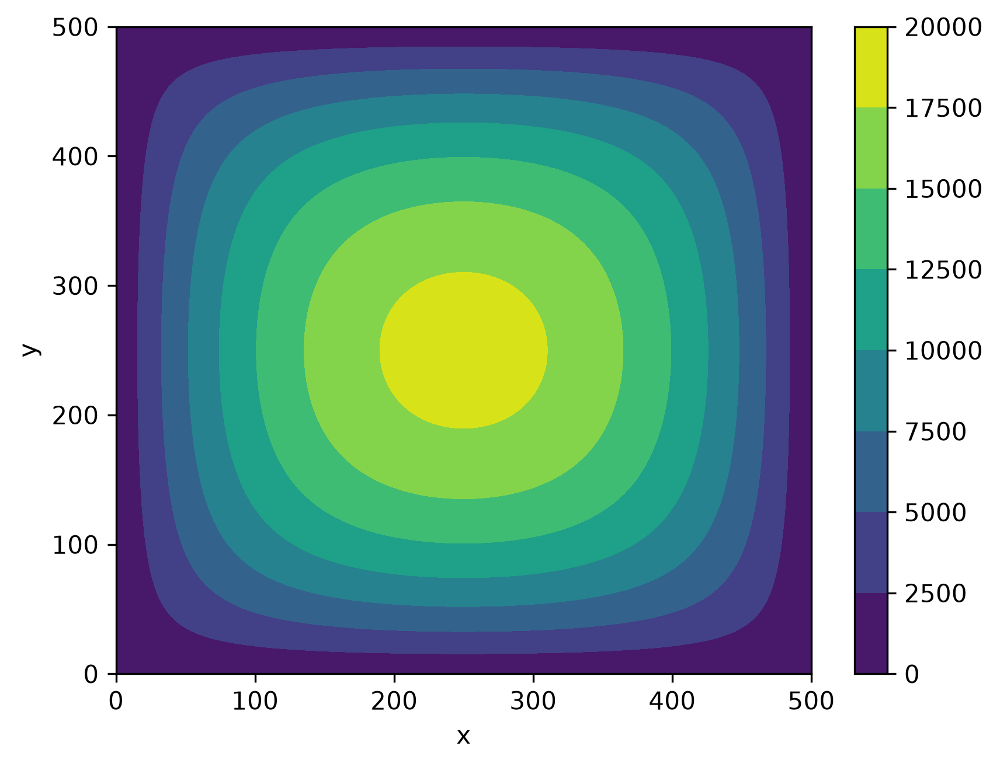

# 二维稳态热传导 / Poisson 方程数值求解器

这是一个使用 Python 编写的二维稳态热传导数值求解小项目。

项目采用有限差分法对二维 Poisson 方程进行离散，并使用 SciPy 的稀疏矩阵和线性方程求解器计算温度场。

目前为项目的第一版。

## 项目功能

当前程序可以完成：

* 建立二维矩形网格
* 对内部节点进行有限差分离散
* 使用 SciPy 建立稀疏矩阵
* 使用 `spsolve` 求解内部节点温度
* 将计算结果恢复成二维温度场
* 绘制温度云图
* 输出最高温度
* 输出最高温度所在位置
* 计算残差，检查线性方程组求解结果
* 通过不同网格数量简单观察网格收敛情况

## 当前计算条件

目前第一版采用以下条件：

* 计算区域为矩形
* 四条边界温度均为 0
* 区域内部热源为常数
* x 和 y 方向网格间距相同
* 只考虑稳态问题

因此，目前程序还是一个基础版本，并不是通用的热传导求解器。

## 使用的库

项目使用：

```text
NumPy
SciPy
Matplotlib
```

主要用途：

* NumPy：建立网格和处理数组
* SciPy：建立稀疏矩阵并求解线性方程组
* Matplotlib：绘制温度场

## 运行方法

首先安装需要的库：

```bash
pip install numpy scipy matplotlib
```

然后运行：

```bash
python poisson_solver.py
```

可以在程序开头修改计算区域和网格数量，例如：

```python
nx = 6
ny = 6

lx = 6
ly = 6
```

## 计算结果

在 6 × 6 网格下，程序计算得到的最高温度为：

```text
2.4
```

随着网格加密，结果如下：

| 网格        | 内部未知节点数 |    最高温度 |
| --------- | ------: | ------: |
| 6 × 6     |      16 |  2.4000 |
| 20 × 20   |     324 |  2.6340 |
| 600 × 600 |  357604 | 2.65215 |

可以看到，随着网格逐渐加密，最高温度逐渐趋于稳定。

## 温度场



## 残差检查

程序使用线性方程组的残差检查求解结果。

当前计算得到的最大残差约为：

```text
1.33e-15
```

说明当前线性方程组得到了较好的数值求解结果。

## 当前版本限制

目前还存在以下限制：

* 只能计算矩形区域
* 四条边界温度只能设为 0
* 只支持相同的 x、y 网格间距
* 内部热源目前为常数
* 只考虑稳态问题

## 后续计划

后续准备逐步增加：

* 非零边界温度
* 不同边界温度
* 不同形式的内部热源
* x、y 方向不同的网格间距
* 自动网格收敛测试

目前先将现有功能作为第一版保存。
